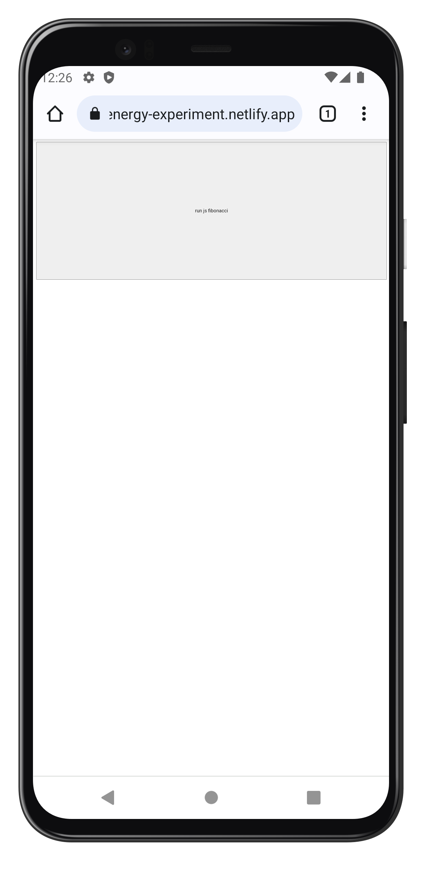
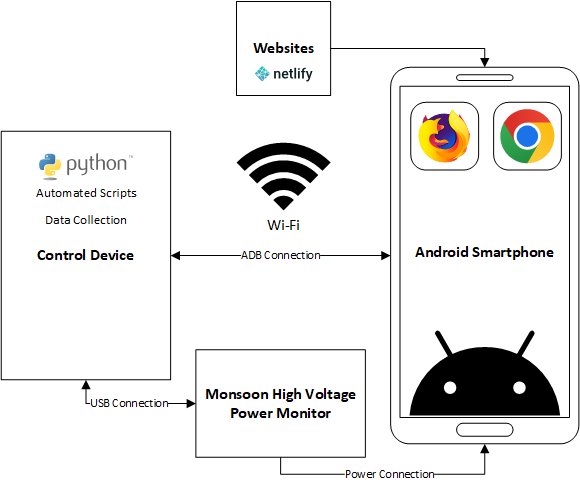
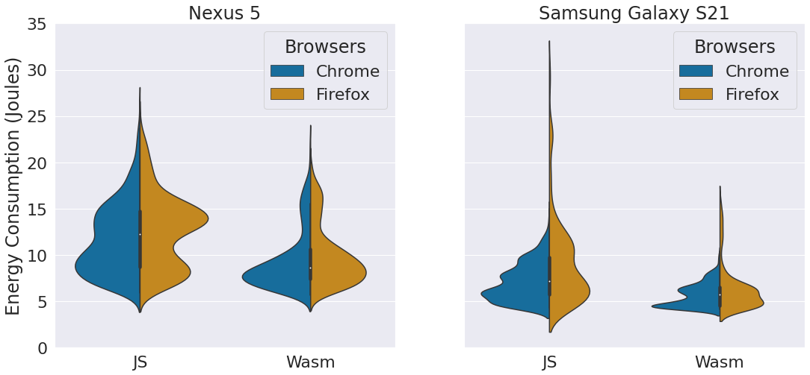

# Comparing the Energy Consumption of WebAssembly and JavaScript in Mobile Browsers

## Devices

| Specifications  | Nexus 5                  | Samsung Galaxy S21 |
|-----------------|--------------------------|--------------------|
| Class           | Low-end                  | High-end           |
| CPU/SoC         | Qualcomm Snapdragon S800 | Exynos 2100        |
| CPU Cores       | 4 Cores                  | 8 Cores            |
| RAM             | 2 GB                     | 8 GB               |
| Battery         | 2,300 mAh                | 4,000 mAh          |
| Release         | October 2013             | January 2021       |
| Android         | 6.0.1                    | 12                 |
| Chrome Version  | 100.0.4896.58            | 99.0.4844.88       |
| Firefox Version | 98.3.0                   | 98.3.0             |

## Algorithms

| Algorithm             | Procedure                                                              |
|-----------------------|------------------------------------------------------------------------|
| Ackermann             | Loop of all combinations of recursive ack([0..3],[0..9]) calculations. |
| Fibonacci             | Recursive calculation of fibonacci position 40.                        |
| Happy numbers         | Loop of calculation of happy numbers sequence until position 50,000.   |
| Humble numbers        | Loop of calculation of humble numbers sequence between 0 and 500,000.  |
| k-Means++             | Calculation of 50 k's with 200 iterations of given random dataset.     |
| Matrix multiplication | Multiplications of 2 given random matrices.                            |
| N-queens              | Calculation of queens problem on a 12x12 board.                        |
| Perfect numbers       | Loop of calculation of perfect numbers sequence between 0 and 500,000. |
| Sequence non squares  | Loop of calculation of non squares sequence between 0 and 5,000,000.   |
| Towers of Hanoi       | Recursive move calculation of 25 items.                                |

| Algorithm (Sorting) | Procedure                                                  |
|---------------------|------------------------------------------------------------|
| Bubble sort         | Sorting of given 25,000 numbers array in reverse order.    |
| Counting sort       | Sorting of given 1,000,000 numbers array in reverse order. |
| Gnome sort          | Sorting of given 25,000 numbers array in reverse order.    |
| Heap sort           | Sorting of given 800,000 numbers array in reverse order.   |
| Insertion sort      | Sorting of given 25,000 numbers array in reverse order.    |
| Merge sort          | Sorting of given 100,000 numbers array in reverse order.   |
| Pancake sort        | Sorting of given 25,000 numbers array in reverse order.    |
| Quick sort          | Sorting of given 1,000,000 numbers array in reverse order. |
| Shell sort          | Sorting of given 1,000,000 numbers array in reverse order. |

## Test Websites

Test websites under `./experiment/websites` can be hosted on any simple HTML web server. We used Netlify for our experiment.



## Automation & Energy Measurement

Further details about the automated measurement can be found under `./experiment/automation/README.md`.



## Results

Our Jupyter notebook of our results can be run inside a docker container.

```bash
cd analysis
docker run --rm -it -p 8888:8888 -v "$PWD":/home/jovyan/work --name notebook jupyter/minimal-notebook
```

