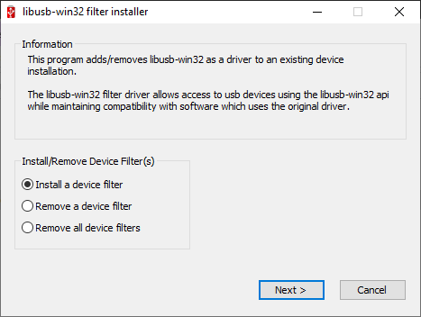
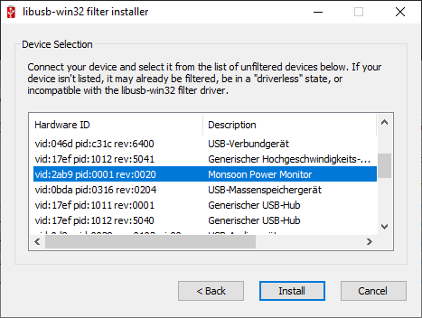

# WASM Energy Experiment

## Monsoon Setup (Windows)

 1. The Power Tool with drivers can be installed as described in the [manual](http://msoon.github.io/powermonitor/PowerTool/doc/Power%20Monitor%20Manual.pdf).
 2. In order to use the Monsoon Power Monitor via the Python API a USB connection is required. On Windows a filter for the usb driver can be used, thus the lib-usb32 devel filter must be used. Download and install [libusb-win32-devel-filter-1.2.6.0.exe](https://sourceforge.net/projects/libusb-win32/files/libusb-win32-releases/1.2.6.0/). The filter can be installed for a turned on Monsoon Power Monitor according to the following screenshots:
    
    
    
    

## Install

```
python -m venv venv
pip install -r requirements.txt
```

## Running experiments

Host of test websites needs to be changed in line 32 of `energy.py`.

Run with dummy energy meter:

```
python energy.py 
```

Run with monsoon energy meter:

```
python energy.py --meter monsoon --filename 24_01_2022.txt --count 30
```

## Problems on Mac M1

`libusb` might has to be installed, there might be a problem with M1 chip architecture.

 - `brew install libusb`

If the following lists USB devices, everything works as expected:

```python
import usb.core
dev = usb.core.find()
print(dev)
```

Otherwise a [solution](https://github.com/pyusb/pyusb/issues/355) might be:

 - `sudo ln -s /opt/homebrew/lib/libusb-1.0.0.dylib //usr/local/lib/libusb.dylib`
